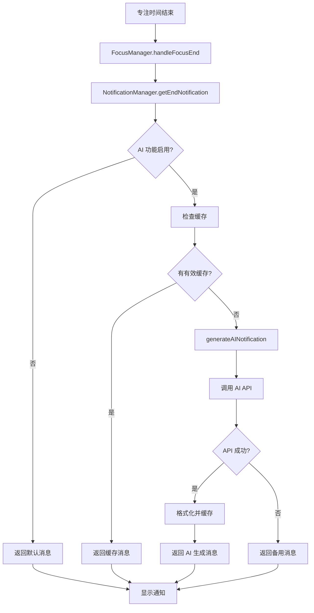

# 通知系统架构统一设计

## 🎯 **问题背景**

之前的通知系统存在设计不一致的问题：

1. **Background Script** (`notificationManager.ts`) 中有 AI 调用逻辑，但实际上是空的（只返回 `null`）
2. **UI 组件** (`AINotificationGenerator.tsx`) 中有完整的 AI 调用实现
3. **共享服务** (`notificationGenerator.ts`) 中也有重复的 AI 调用逻辑
4. 三个地方有不同的 prompt 模板和系统提示词，导致不一致

## ✅ **统一后的架构**

### **1. 主要逻辑：Background Script**
- **文件**: `chrome-extension/src/background/managers/notificationManager.ts`
- **职责**: 唯一的 AI 通知生成入口
- **功能**:
  - 实际的 AI API 调用
  - 统一的 prompt 模板和系统提示词
  - 缓存管理
  - 错误处理和备用消息

### **2. UI 组件：已弃用**
- **文件**: `packages/ui/lib/components/AINotificationGenerator.tsx`
- **状态**: 已弃用，只返回 `null`
- **原因**: 避免重复逻辑，统一到 Background Script

### **3. 共享服务：简化为工具函数**
- **文件**: `packages/shared/lib/services/notificationGenerator.ts`
- **状态**: 主要功能已弃用
- **保留**: 备用消息常量和工具函数
- **用途**: 为 Background Script 提供备用消息

## 🔄 **工作流程**



## 🛠 **技术实现**

### **AI API 调用**
```typescript
private async callAIService(aiConfig: any, prompt: string): Promise<string | null> {
  // 实际的 fetch 调用
  const response = await fetch(apiEndpoint, {
    method: 'POST',
    headers: {
      'Content-Type': 'application/json',
      Authorization: `Bearer; ${aiConfig.apiKey}`,
    },
    body: JSON.stringify(requestBody),
  });
  // 处理响应和格式化
}
```

### **统一的 Prompt 模板**
- 支持自定义系统提示词 (`aiConfig.systemPrompt`)
- 支持自定义用户提示词模板 (`aiConfig.promptTemplate`)
- 包含专注时长变量 `{duration}`
- 包含当前时间信息

### **缓存策略**
- 使用 `notificationCacheStorage` 统一管理
- 支持过期时间（默认 60 分钟）
- 预生成机制（专注开始时提前生成）

## 📋 **配置选项**

用户可以在 AI 设置中配置：

1. **启用/禁用** AI 通知
2. **API 密钥** 和 **提供商**（DeepSeek/OpenAI）
3. **模型名称**
4. **自定义系统提示词**
5. **自定义用户提示词模板**
6. **预生成时间**

## 🔧 **备用机制**

当 AI 生成失败时，系统会：

1. 记录错误日志
2. 从共享的 `FALLBACK_MESSAGES` 中随机选择一条消息
3. 确保用户始终能收到通知

## 📈 **优势**

1. **统一性**: 所有 AI 调用逻辑集中在一处
2. **可维护性**: 减少重复代码，易于维护
3. **可配置性**: 支持用户自定义 prompt
4. **可靠性**: 完善的错误处理和备用机制
5. **性能**: 缓存机制减少 API 调用

## 🚀 **后续优化**

1. 支持更多 AI 提供商
2. 添加通知历史记录
3. 支持多语言 prompt
4. 添加 A/B 测试功能
